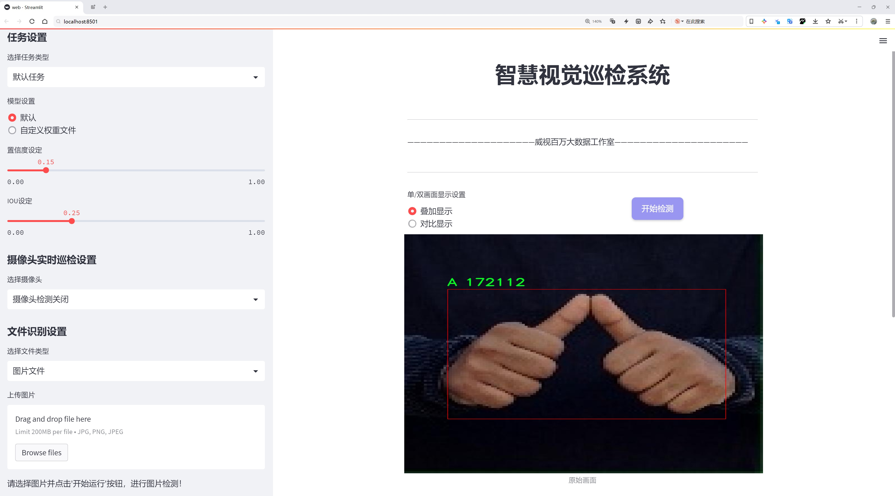
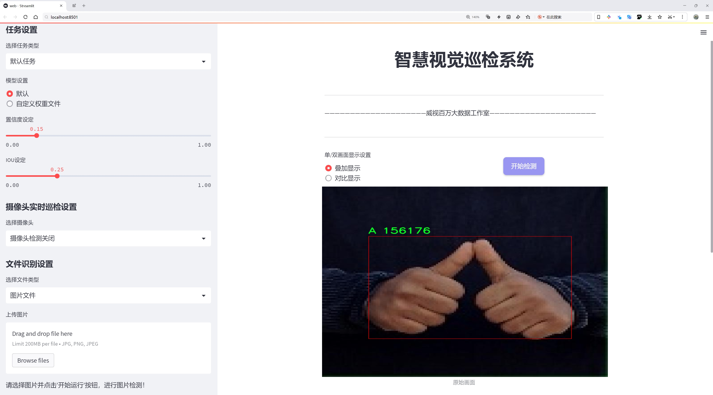
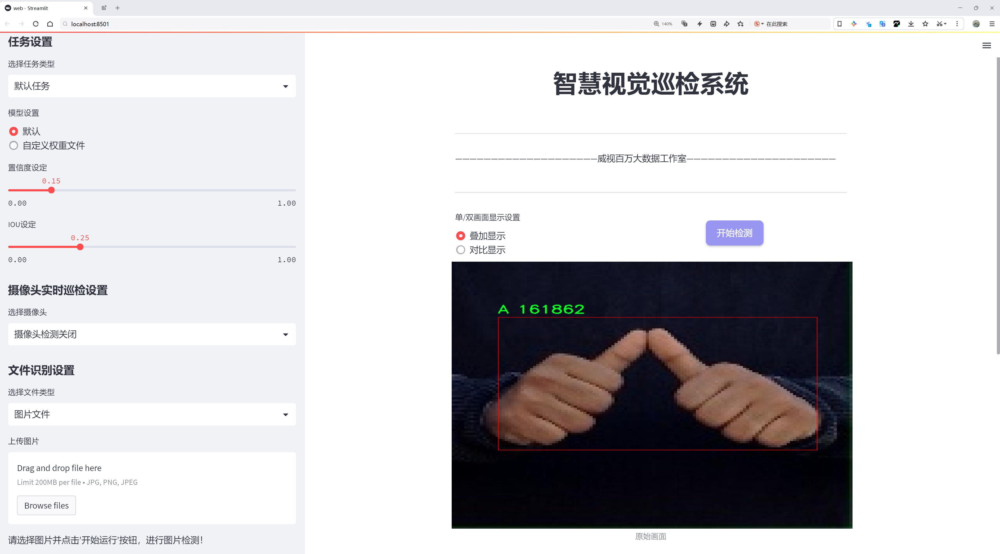
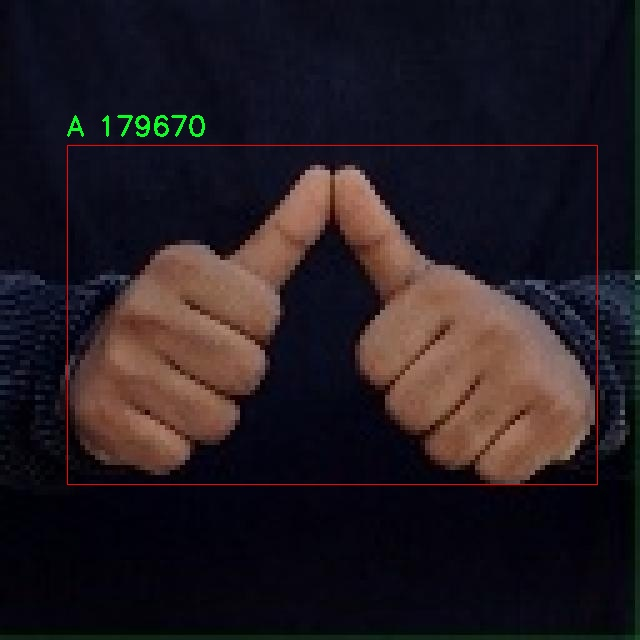
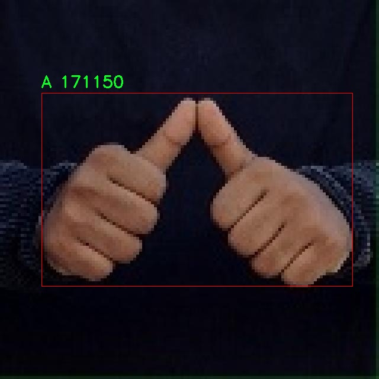
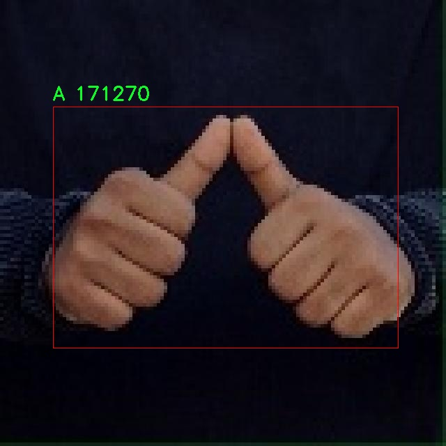
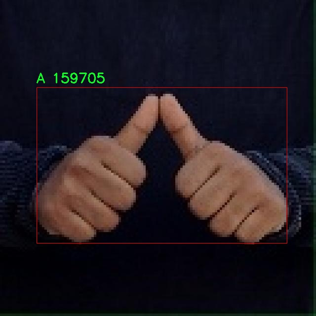
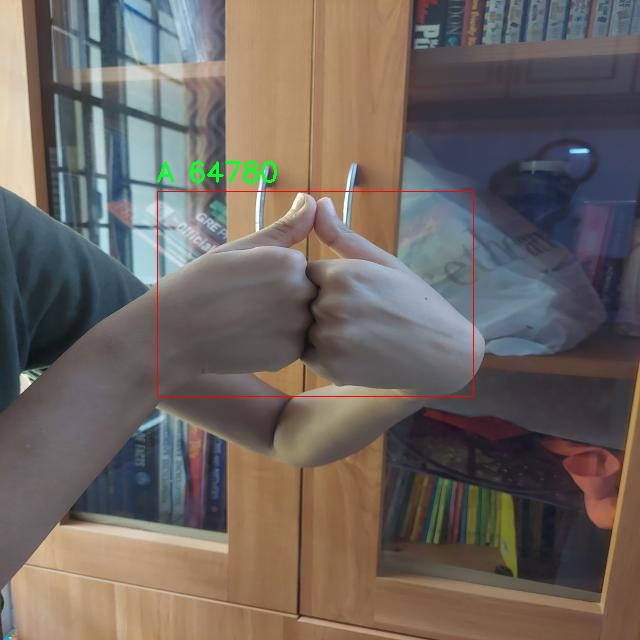

# 手语手势识别检测系统源码分享
 # [一条龙教学YOLOV8标注好的数据集一键训练_70+全套改进创新点发刊_Web前端展示]

### 1.研究背景与意义

项目参考[AAAI Association for the Advancement of Artificial Intelligence](https://gitee.com/qunmasj/projects)

项目来源[AACV Association for the Advancement of Computer Vision](https://kdocs.cn/l/cszuIiCKVNis)

研究背景与意义

随着信息技术的迅猛发展，手语作为一种重要的交流方式，越来越受到社会的关注。手语不仅是聋哑人士沟通的主要手段，也是实现无障碍交流的重要工具。根据世界卫生组织的统计，全球约有4.66亿人存在听力障碍，这一庞大的群体在日常生活、学习和工作中面临着沟通的挑战。因此，开发高效、准确的手语手势识别系统，不仅能够提升聋哑人士的生活质量，还能促进社会的包容性和多样性。

近年来，深度学习技术的迅猛发展为手语识别领域带来了新的机遇。YOLO（You Only Look Once）系列模型以其高效的实时目标检测能力，成为计算机视觉领域的重要工具。YOLOv8作为该系列的最新版本，进一步提升了检测精度和速度，适用于各种复杂场景下的目标识别任务。基于YOLOv8的手语手势识别系统，能够实现对手语手势的快速、准确识别，为聋哑人士提供更为便捷的交流方式。

本研究所使用的数据集包含3300张手语手势图像，涵盖了两个主要类别：手语字母“A”和“Z”。这一数据集的构建不仅为手语手势识别提供了基础数据支持，也为后续的模型训练和验证提供了丰富的样本。在数据集的设计上，考虑到了手势的多样性和复杂性，确保模型在不同环境和条件下的适应性。这为基于YOLOv8的手语手势识别系统的有效性提供了保障。

在技术层面，改进YOLOv8模型的研究具有重要的理论和实践意义。通过对模型结构的优化和参数的调整，可以进一步提升手语手势识别的准确率和实时性。此外，结合图像处理技术，如数据增强、图像预处理等，可以有效提升模型的鲁棒性，减少外部环境对识别结果的影响。这些技术创新不仅推动了手语识别技术的发展，也为其他领域的目标检测提供了借鉴。

综上所述，基于改进YOLOv8的手语手势识别系统的研究，不仅在技术上具有重要的创新意义，也在社会层面上为聋哑人士的沟通提供了有效的解决方案。通过提升手语识别的准确性和实时性，能够有效促进聋哑人士与社会的互动，增强他们的参与感和归属感。未来，随着技术的不断进步和数据集的不断丰富，手语手势识别系统有望在更广泛的应用场景中发挥重要作用，为构建更加包容的社会贡献力量。

### 2.图片演示







##### 注意：由于此博客编辑较早，上面“2.图片演示”和“3.视频演示”展示的系统图片或者视频可能为老版本，新版本在老版本的基础上升级如下：（实际效果以升级的新版本为准）

  （1）适配了YOLOV8的“目标检测”模型和“实例分割”模型，通过加载相应的权重（.pt）文件即可自适应加载模型。

  （2）支持“图片识别”、“视频识别”、“摄像头实时识别”三种识别模式。

  （3）支持“图片识别”、“视频识别”、“摄像头实时识别”三种识别结果保存导出，解决手动导出（容易卡顿出现爆内存）存在的问题，识别完自动保存结果并导出到tempDir中。

  （4）支持Web前端系统中的标题、背景图等自定义修改，后面提供修改教程。

  另外本项目提供训练的数据集和训练教程,暂不提供权重文件（best.pt）,需要您按照教程进行训练后实现图片演示和Web前端界面演示的效果。

### 3.视频演示

[3.1 视频演示](https://www.bilibili.com/video/BV1eesaeTEzM/)

### 4.数据集信息展示

##### 4.1 本项目数据集详细数据（类别数＆类别名）

nc: 2
names: ['A', 'Z']


##### 4.2 本项目数据集信息介绍

数据集信息展示

在手语手势识别领域，数据集的构建与选择至关重要。本研究采用的数据集名为“sign language”，其主要目的是为了训练和改进YOLOv8模型，以实现更高效的手语手势识别系统。该数据集专注于两种特定的手语手势，分别为字母“A”和字母“Z”。这两种手势不仅在手语交流中具有基础性和重要性，而且为模型的训练提供了良好的起点，使其能够在后续的扩展中涵盖更多的手势。

数据集的类别数量为2，分别对应于手语字母“A”和“Z”。在手语中，这两个字母的手势形态具有明显的特征，能够有效地帮助模型学习和识别。字母“A”的手势通常表现为一个握拳的姿势，而字母“Z”的手势则是通过手指的移动来描绘字母的形状。这种简洁而明确的分类不仅降低了模型训练的复杂性，也为后续的手势扩展提供了良好的基础。

“sign language”数据集的构建过程遵循了严格的标准，确保了数据的多样性和代表性。数据集中包含了大量的手势图像，这些图像是在不同的光照条件、背景环境以及手势执行者的不同角度下采集的。这种多样性不仅增强了模型的鲁棒性，也提高了其在实际应用中的适应能力。此外，数据集中的图像均经过精心标注，确保每个手势的边界框准确无误，为YOLOv8模型的训练提供了可靠的监督信号。

在数据集的使用过程中，研究者们将利用数据增强技术来进一步扩展数据集的有效性。通过对原始图像进行旋转、缩放、裁剪和颜色调整等操作，可以生成更多的训练样本，从而提升模型的泛化能力。这一过程不仅有助于缓解过拟合问题，还能使模型在面对未见过的手势时表现得更加稳健。

为了评估模型的性能，研究团队还将使用标准的评估指标，如准确率、召回率和F1-score等，对模型在“sign language”数据集上的表现进行全面分析。这些指标将帮助研究者了解模型在识别字母“A”和“Z”手势时的效果，从而为后续的模型优化提供数据支持。

总之，“sign language”数据集为手语手势识别系统的训练与改进提供了坚实的基础。通过对这两个手势的深入研究与分析，研究者们希望能够在YOLOv8模型的基础上，开发出更为精准和高效的手语识别系统，进而推动手语翻译技术的发展，为聋哑人士的沟通与交流提供更为便利的工具。随着技术的不断进步，未来有望将更多的手势纳入识别范围，进一步提升手语识别的全面性和实用性。











### 5.全套项目环境部署视频教程（零基础手把手教学）

[5.1 环境部署教程链接（零基础手把手教学）](https://www.ixigua.com/7404473917358506534?logTag=c807d0cbc21c0ef59de5)


[5.2 安装Python虚拟环境创建和依赖库安装视频教程链接（零基础手把手教学）](https://www.ixigua.com/7404474678003106304?logTag=1f1041108cd1f708b01a)

### 6.手把手YOLOV8训练视频教程（零基础小白有手就能学会）

[6.1 手把手YOLOV8训练视频教程（零基础小白有手就能学会）](https://www.ixigua.com/7404477157818401292?logTag=d31a2dfd1983c9668658)

### 7.70+种全套YOLOV8创新点代码加载调参视频教程（一键加载写好的改进模型的配置文件）

[7.1 70+种全套YOLOV8创新点代码加载调参视频教程（一键加载写好的改进模型的配置文件）](https://www.ixigua.com/7404478314661806627?logTag=29066f8288e3f4eea3a4)

### 8.70+种全套YOLOV8创新点原理讲解（非科班也可以轻松写刊发刊，V10版本正在科研待更新）

由于篇幅限制，每个创新点的具体原理讲解就不一一展开，具体见下列网址中的创新点对应子项目的技术原理博客网址【Blog】：


[8.1 70+种全套YOLOV8创新点原理讲解链接](https://gitee.com/qunmasj/good)

### 9.系统功能展示（检测对象为举例，实际内容以本项目数据集为准）

图9.1.系统支持检测结果表格显示

  图9.2.系统支持置信度和IOU阈值手动调节

  图9.3.系统支持自定义加载权重文件best.pt(需要你通过步骤5中训练获得)

  图9.4.系统支持摄像头实时识别

  图9.5.系统支持图片识别

  图9.6.系统支持视频识别

  图9.7.系统支持识别结果文件自动保存

  图9.8.系统支持Excel导出检测结果数据


### 10.原始YOLOV8算法原理

原始YOLOv8算法原理

YOLOv8作为YOLO系列的最新版本，标志着目标检测技术的又一次飞跃。其设计理念源于将目标检测任务视为一个回归问题，通过单一的神经网络模型同时预测目标的位置和类别。与之前的版本相比，YOLOv8在检测精度和速度上都取得了显著的提升，成为了当前流行的目标检测算法之一。YOLOv8的架构由输入端、骨干网络、颈部网络和头部网络四个主要部分组成，各个部分相辅相成，共同实现高效的目标检测。

在输入端，YOLOv8采用了马赛克数据增强技术，这种方法通过将多张图像拼接在一起，增加了训练数据的多样性，从而提高了模型的泛化能力。此外，YOLOv8还引入了自适应锚框计算和自适应灰度填充，这些技术使得模型能够更好地适应不同的输入图像特征，进一步提升了检测的准确性。

骨干网络是YOLOv8的核心部分，其主要功能是提取图像特征。YOLOv8采用了C2f模块和SPPF（Spatial Pyramid Pooling Fusion）结构。C2f模块的设计灵感来源于YOLOv7的ELAN结构，通过引入更多的分支跨层连接，增强了模型的梯度流，使得特征表示能力得到了显著提升。SPPF模块则通过多尺度的池化操作，增强了网络对不同尺度特征的抽象能力。这种设计使得YOLOv8能够在处理复杂场景时，依然保持较高的检测精度。

颈部网络采用了路径聚合网络（PAN）结构，这一设计使得YOLOv8能够有效地融合来自不同尺度的特征图信息。通过对特征的有效聚合，YOLOv8能够更好地处理不同大小的目标，提高了对小目标的检测能力。颈部网络的作用在于将骨干网络提取的特征进行进一步的处理和整合，为后续的目标检测提供更加丰富的信息。

在头部网络部分，YOLOv8采用了解耦的检测头结构，这一创新设计将分类和回归任务分离开来，使得模型在处理复杂场景时能够更加专注于各自的任务。具体而言，分类分支采用了二元交叉熵损失（Binary Cross Entropy Loss），而回归分支则结合了分布焦点损失（Distribution Focal Loss）和完全交并比损失（Complete Intersection over Union Loss），以提升模型对边界框预测的精准性。这种解耦设计不仅提高了模型的检测性能，也使得模型在训练时能够更好地优化各个任务的损失。

YOLOv8的另一个重要创新是引入了无锚框检测（Anchor-Free）方法。这一方法的核心在于不再依赖于预先定义的锚框，而是通过回归方式直接预测目标的位置和大小。这种设计极大地简化了模型的结构，减少了锚框预测的数量，加速了非最大抑制（Non-Maximum Suppression, NMS）过程，从而提高了检测速度和精度。传统的锚框方法在处理不同尺度和形状的目标时往往需要复杂的调整，而YOLOv8的无锚框方法则使得模型能够更快地聚焦于目标位置的邻近点，使得预测框更接近于实际边界框区域。

在实际应用中，YOLOv8展现出了极高的灵活性和适应性。根据不同的使用场景，YOLOv8提供了多种模型版本，包括YOLOv8n、YOLOv8s、YOLOv8m、YOLOv8l和YOLOv8x等。不同版本的模型在参数量和检测速度上有所差异，用户可以根据实际需求选择合适的模型。例如，YOLOv8n作为参数量最小且检测速度最快的版本，特别适合实时检测任务，而YOLOv8x则在检测精度上表现更为优越，适合对精度要求较高的应用场景。

综上所述，YOLOv8通过一系列创新的设计和改进，成功地提升了目标检测的精度和速度。其独特的网络结构、有效的特征融合机制以及无锚框检测方法，使得YOLOv8在复杂场景下依然能够保持高效的检测性能。随着YOLOv8的不断发展和应用，目标检测技术的未来将更加光明，能够为各类智能应用提供强有力的支持。


### 11.项目核心源码讲解（再也不用担心看不懂代码逻辑）

#### 11.1 ui.py

以下是经过简化和注释的核心代码部分：

```python
import sys
import subprocess

def run_script(script_path):
    """
    使用当前 Python 环境运行指定的脚本。

    Args:
        script_path (str): 要运行的脚本路径
    """
    # 获取当前 Python 解释器的路径
    python_path = sys.executable

    # 构建运行命令，使用 streamlit 运行指定的脚本
    command = f'"{python_path}" -m streamlit run "{script_path}"'

    # 执行命令
    result = subprocess.run(command, shell=True)
    # 检查命令执行结果，如果返回码不为0，表示出错
    if result.returncode != 0:
        print("脚本运行出错。")

# 主程序入口
if __name__ == "__main__":
    # 指定要运行的脚本路径
    script_path = "web.py"  # 假设脚本在当前目录下

    # 调用函数运行脚本
    run_script(script_path)
```

### 代码分析与注释：

1. **导入模块**：
   - `sys`：用于访问与 Python 解释器相关的变量和函数。
   - `subprocess`：用于执行外部命令和程序。

2. **定义 `run_script` 函数**：
   - 此函数接受一个参数 `script_path`，表示要运行的 Python 脚本的路径。
   - 在函数内部，首先获取当前 Python 解释器的路径，以便在后续的命令中使用。

3. **构建命令**：
   - 使用 `streamlit` 运行指定的脚本，构建的命令为：`python -m streamlit run "script_path"`。

4. **执行命令**：
   - 使用 `subprocess.run` 执行构建的命令，并将 `shell` 参数设置为 `True`，允许在 shell 中执行命令。
   - 检查命令的返回码，如果返回码不为0，表示脚本运行出错，打印相应的错误信息。

5. **主程序入口**：
   - 使用 `if __name__ == "__main__":` 确保该代码块仅在直接运行脚本时执行。
   - 指定要运行的脚本路径为 `web.py`，并调用 `run_script` 函数来执行该脚本。

### 总结：
该代码的核心功能是通过当前 Python 环境运行指定的 Streamlit 脚本，并处理可能出现的错误。

这个程序文件名为 `ui.py`，它的主要功能是运行一个指定的 Python 脚本，具体是通过 Streamlit 框架来启动一个 Web 应用。

首先，文件中导入了一些必要的模块，包括 `sys`、`os` 和 `subprocess`。`sys` 模块用于访问与 Python 解释器相关的变量和函数，`os` 模块提供了与操作系统交互的功能，而 `subprocess` 模块则用于创建新进程、连接到它们的输入/输出/错误管道，并获取它们的返回码。

接下来，文件中定义了一个名为 `run_script` 的函数，该函数接受一个参数 `script_path`，这个参数是要运行的脚本的路径。函数内部首先获取当前 Python 解释器的路径，使用 `sys.executable` 来实现。然后，构建一个命令字符串，这个命令会使用当前的 Python 解释器来运行指定的脚本，并通过 Streamlit 的 `run` 命令来启动 Web 应用。

接着，使用 `subprocess.run` 方法来执行这个命令，`shell=True` 参数表示在一个新的 shell 中执行命令。函数会检查命令的返回码，如果返回码不为 0，说明脚本运行过程中出现了错误，程序会打印出“脚本运行出错”的提示信息。

在文件的最后部分，使用 `if __name__ == "__main__":` 语句来确保当该文件作为主程序运行时，以下代码才会被执行。这里指定了要运行的脚本路径，调用 `abs_path` 函数来获取 `web.py` 的绝对路径。最后，调用 `run_script` 函数来执行这个脚本。

总体来看，这个程序的主要目的是通过指定的 Python 脚本路径来启动一个基于 Streamlit 的 Web 应用，并处理可能出现的错误。

#### 11.2 code\ultralytics\data\dataset.py

以下是经过简化并注释的代码，保留了核心部分：

```python
import numpy as np
import torch
from pathlib import Path
from ultralytics.utils import TQDM, get_hash, img2label_paths, LOGGER
from .base import BaseDataset
from .utils import save_dataset_cache_file, load_dataset_cache_file

# Ultralytics 数据集缓存版本
DATASET_CACHE_VERSION = "1.0.3"

class YOLODataset(BaseDataset):
    """
    YOLO 数据集类，用于加载目标检测和/或分割标签。
    """

    def __init__(self, *args, data=None, task="detect", **kwargs):
        """初始化 YOLODataset，配置分割和关键点选项。"""
        self.use_segments = task == "segment"  # 是否使用分割
        self.use_keypoints = task == "pose"  # 是否使用关键点
        self.data = data
        assert not (self.use_segments and self.use_keypoints), "不能同时使用分割和关键点。"  # 确保只使用一种任务
        super().__init__(*args, **kwargs)

    def cache_labels(self, path=Path("./labels.cache")):
        """
        缓存数据集标签，检查图像并读取形状。

        Args:
            path (Path): 缓存文件保存路径 (默认: Path('./labels.cache')).
        Returns:
            (dict): 标签字典。
        """
        x = {"labels": []}  # 初始化标签字典
        nm, nf, ne, nc, msgs = 0, 0, 0, 0, []  # 统计信息：缺失、找到、空、损坏的数量
        total = len(self.im_files)  # 图像文件总数

        # 使用多线程检查图像和标签
        with ThreadPool(NUM_THREADS) as pool:
            results = pool.imap(
                func=verify_image_label,
                iterable=zip(self.im_files, self.label_files)
            )
            pbar = TQDM(results, desc="扫描标签...", total=total)  # 进度条
            for im_file, lb, shape, segments, keypoint, nm_f, nf_f, ne_f, nc_f, msg in pbar:
                nm += nm_f
                nf += nf_f
                ne += ne_f
                nc += nc_f
                if im_file:
                    x["labels"].append(
                        dict(
                            im_file=im_file,
                            shape=shape,
                            cls=lb[:, 0:1],  # 类别
                            bboxes=lb[:, 1:],  # 边界框
                            segments=segments,
                            keypoints=keypoint,
                            normalized=True,
                            bbox_format="xywh",
                        )
                    )
                if msg:
                    msgs.append(msg)
                pbar.desc = f"扫描标签... {nf} 找到的图像, {nm + ne} 背景, {nc} 损坏"

        if msgs:
            LOGGER.info("\n".join(msgs))  # 记录警告信息
        x["hash"] = get_hash(self.label_files + self.im_files)  # 生成标签哈希
        save_dataset_cache_file(self.prefix, path, x)  # 保存缓存
        return x

    def get_labels(self):
        """返回 YOLO 训练的标签字典。"""
        self.label_files = img2label_paths(self.im_files)  # 获取标签文件路径
        cache_path = Path(self.label_files[0]).parent.with_suffix(".cache")  # 缓存文件路径
        try:
            cache = load_dataset_cache_file(cache_path)  # 尝试加载缓存文件
            assert cache["version"] == DATASET_CACHE_VERSION  # 检查版本
            assert cache["hash"] == get_hash(self.label_files + self.im_files)  # 检查哈希
        except (FileNotFoundError, AssertionError):
            cache = self.cache_labels(cache_path)  # 如果加载失败，则缓存标签

        labels = cache["labels"]  # 获取标签
        self.im_files = [lb["im_file"] for lb in labels]  # 更新图像文件列表
        return labels  # 返回标签

    @staticmethod
    def collate_fn(batch):
        """将数据样本合并为批次。"""
        new_batch = {}
        keys = batch[0].keys()
        values = list(zip(*[list(b.values()) for b in batch]))
        for i, k in enumerate(keys):
            value = values[i]
            if k == "img":
                value = torch.stack(value, 0)  # 将图像堆叠
            if k in ["masks", "keypoints", "bboxes", "cls", "segments", "obb"]:
                value = torch.cat(value, 0)  # 合并其他数据
            new_batch[k] = value
        return new_batch  # 返回合并后的批次
```

### 代码注释说明：
1. **类的定义**：`YOLODataset`类继承自`BaseDataset`，用于处理YOLO格式的数据集。
2. **初始化方法**：根据任务类型（检测、分割、关键点）设置相应的标志，并确保不同时使用分割和关键点。
3. **缓存标签**：`cache_labels`方法用于缓存标签信息，包括检查图像的有效性，并记录找到的图像、缺失的图像和损坏的图像数量。
4. **获取标签**：`get_labels`方法用于获取训练所需的标签，并支持从缓存中加载。
5. **合并批次**：`collate_fn`静态方法用于将多个样本合并为一个批次，适用于PyTorch的数据加载器。

这个程序文件主要定义了用于YOLO（You Only Look Once）目标检测和分类的几个数据集类，包括`YOLODataset`和`ClassificationDataset`，以及一些辅助函数。文件的核心功能是处理数据集的加载、标签的缓存、图像的验证和数据增强等。

首先，`YOLODataset`类是一个用于加载YOLO格式的目标检测和分割标签的数据集类。它的构造函数接收一些参数，如数据字典和任务类型（检测、分割或姿态估计），并根据任务类型设置相应的标志。类中定义了多个方法，其中`cache_labels`方法用于缓存数据集标签，检查图像并读取其形状。它会创建一个缓存文件，存储图像和标签的相关信息，以便后续快速加载。

`get_labels`方法用于返回YOLO训练所需的标签字典。它尝试加载之前缓存的标签，如果没有找到缓存文件，则调用`cache_labels`方法重新生成标签缓存。该方法还会检查标签的完整性，确保每个图像都有对应的标签，并记录任何警告信息。

`build_transforms`方法用于构建数据增强的转换操作，依据是否启用增强和任务类型，返回相应的转换列表。`update_labels_info`方法则是对标签格式进行自定义处理，主要用于处理边界框、分割和关键点信息。

`collate_fn`静态方法用于将多个数据样本合并成一个批次，适用于PyTorch的数据加载器。

接下来，`ClassificationDataset`类是一个用于YOLO分类任务的数据集类，继承自`torchvision.datasets.ImageFolder`。它的构造函数接收数据集路径、参数设置、增强和缓存选项，并验证图像的有效性。`__getitem__`方法用于返回指定索引的样本和目标，支持在内存或磁盘上缓存图像。

文件中还定义了几个辅助函数，如`load_dataset_cache_file`和`save_dataset_cache_file`，用于加载和保存数据集的缓存文件，提升数据加载的效率。

最后，`SemanticDataset`类是一个占位符类，未来可以扩展以支持语义分割任务，目前尚未实现具体功能。

总体来说，这个文件为YOLO模型的训练提供了数据集的管理和处理功能，确保数据的有效性和加载效率。

#### 11.3 70+种YOLOv8算法改进源码大全和调试加载训练教程（非必要）\ultralytics\nn\extra_modules\ops_dcnv3\test.py

以下是代码中最核心的部分，并附上详细的中文注释：

```python
import torch
from functions.dcnv3_func import DCNv3Function, dcnv3_core_pytorch

# 输入和输出的尺寸
H_in, W_in = 8, 8  # 输入图像的高度和宽度
N, M, D = 2, 4, 16  # N为批量大小，M为通道数，D为每个通道的深度
Kh, Kw = 3, 3  # 卷积核的高度和宽度
remove_center = False  # 是否移除中心点
P = Kh * Kw - remove_center  # 每个卷积核的点数
offset_scale = 2.0  # 偏移缩放因子
pad = 1  # 填充大小
dilation = 1  # 膨胀率
stride = 1  # 步幅
# 计算输出的高度和宽度
H_out = (H_in + 2 * pad - (dilation * (Kh - 1) + 1)) // stride + 1
W_out = (W_in + 2 * pad - (dilation * (Kw - 1) + 1)) // stride + 1

# 检查前向传播的输出是否与PyTorch的输出相等（双精度）
@torch.no_grad()
def check_forward_equal_with_pytorch_double():
    # 随机生成输入、偏移和掩码
    input = torch.rand(N, H_in, W_in, M*D).cuda() * 0.01
    offset = torch.rand(N, H_out, W_out, M*P*2).cuda() * 10
    mask = torch.rand(N, H_out, W_out, M, P).cuda() + 1e-5
    mask /= mask.sum(-1, keepdim=True)  # 归一化掩码
    mask = mask.reshape(N, H_out, W_out, M*P)

    # 使用PyTorch的实现进行前向传播
    output_pytorch = dcnv3_core_pytorch(
        input.double(),
        offset.double(),
        mask.double(),
        Kh, Kw, stride, stride, Kh // 2, Kw // 2, dilation, dilation, M, D, offset_scale, remove_center).detach().cpu()

    # 使用自定义的DCNv3函数进行前向传播
    output_cuda = DCNv3Function.apply(
        input.double(),
        offset.double(),
        mask.double(),
        Kh, Kw, stride, stride, Kh // 2, Kw // 2, dilation, dilation, M, D, offset_scale,
        im2col_step=2, remove_center).detach().cpu()

    # 检查两个输出是否相近
    fwdok = torch.allclose(output_cuda, output_pytorch)
    max_abs_err = (output_cuda - output_pytorch).abs().max()  # 最大绝对误差
    max_rel_err = ((output_cuda - output_pytorch).abs() / output_pytorch.abs()).max()  # 最大相对误差
    print('>>> forward double')
    print(f'* {fwdok} check_forward_equal_with_pytorch_double: max_abs_err {max_abs_err:.2e} max_rel_err {max_rel_err:.2e}')

# 主函数，执行前向和反向传播的检查
if __name__ == '__main__':
    check_forward_equal_with_pytorch_double()  # 检查双精度前向传播
    # 这里可以添加更多的检查，例如浮点数前向传播和反向传播的检查
```

### 代码核心部分解释：
1. **输入输出参数设置**：定义了输入图像的尺寸、卷积核的尺寸、批量大小等参数。
2. **前向传播检查**：`check_forward_equal_with_pytorch_double` 函数用于检查自定义的 DCNv3 实现与 PyTorch 官方实现的输出是否一致。它生成随机输入、偏移和掩码，然后分别使用两种实现进行前向传播，最后比较输出。
3. **误差计算**：计算最大绝对误差和最大相对误差，以评估两个实现之间的差异。

### 注意事项：
- 代码中使用了 CUDA 来加速计算，因此需要在支持 CUDA 的环境中运行。
- 这里的实现是针对特定的深度学习模型的，主要用于验证自定义卷积操作的正确性。

这个程序文件是一个用于测试和验证DCNv3（Deformable Convolutional Networks v3）功能的Python脚本，主要使用PyTorch框架。程序的主要目的是检查DCNv3在前向和反向传播过程中的输出是否与PyTorch的标准实现相匹配，并测量其性能。

首先，程序导入了一些必要的库，包括PyTorch及其神经网络模块，以及用于进行数值验证的`gradcheck`。接着，定义了一些与输入输出相关的参数，例如输入的高度和宽度（`H_in`和`W_in`），通道数（`N`和`M`），以及卷积核的大小（`Kh`和`Kw`）。这些参数将用于生成随机输入数据和计算输出。

接下来，程序定义了几个主要的函数来进行验证：

1. `check_forward_equal_with_pytorch_double`：该函数用于检查DCNv3在双精度浮点数下的前向传播输出是否与PyTorch的实现一致。它生成随机输入、偏移量和掩码，并调用自定义的DCNv3函数和PyTorch的标准实现，比较它们的输出是否相近，并打印出最大绝对误差和相对误差。

2. `check_forward_equal_with_pytorch_float`：与上一个函数类似，但使用单精度浮点数进行验证。

3. `check_backward_equal_with_pytorch_double`和`check_backward_equal_with_pytorch_float`：这两个函数分别用于检查DCNv3在双精度和单精度下的反向传播输出是否与PyTorch的实现一致。它们生成随机输入并计算梯度，然后比较DCNv3和PyTorch的梯度是否相近。

4. `check_time_cost`：该函数用于测量DCNv3的前向传播时间。它生成一定大小的输入数据，并多次调用DCNv3函数以计算平均时间消耗。

在主程序部分，依次调用上述验证函数，首先检查前向传播的正确性，然后对不同通道数进行反向传播的验证，最后测量不同`im2col_step`值下的时间消耗。

整个程序的设计旨在确保DCNv3的实现是正确的，并且在性能上也能够满足需求。通过这些测试，开发者可以确认其自定义的DCNv3实现与PyTorch的标准实现一致，并且在实际应用中表现良好。

#### 11.4 code\ultralytics\data\annotator.py

以下是经过简化和注释的核心代码部分：

```python
from pathlib import Path
from ultralytics import SAM, YOLO

def auto_annotate(data, det_model="yolov8x.pt", sam_model="sam_b.pt", device="", output_dir=None):
    """
    自动为图像添加注释，使用YOLO目标检测模型和SAM分割模型。

    参数:
        data (str): 包含待注释图像的文件夹路径。
        det_model (str, optional): 预训练的YOLO检测模型，默认为'yolov8x.pt'。
        sam_model (str, optional): 预训练的SAM分割模型，默认为'sam_b.pt'。
        device (str, optional): 运行模型的设备，默认为空字符串（CPU或可用的GPU）。
        output_dir (str | None | optional): 保存注释结果的目录。
            默认为与'data'相同目录下的'labels'文件夹。

    示例:
        auto_annotate(data='ultralytics/assets', det_model='yolov8n.pt', sam_model='mobile_sam.pt')
    """
    # 加载YOLO目标检测模型
    det_model = YOLO(det_model)
    # 加载SAM分割模型
    sam_model = SAM(sam_model)

    # 将数据路径转换为Path对象
    data = Path(data)
    # 如果未指定输出目录，则创建一个默认的输出目录
    if not output_dir:
        output_dir = data.parent / f"{data.stem}_auto_annotate_labels"
    # 创建输出目录（如果不存在）
    Path(output_dir).mkdir(exist_ok=True, parents=True)

    # 使用YOLO模型进行目标检测，返回检测结果
    det_results = det_model(data, stream=True, device=device)

    # 遍历每个检测结果
    for result in det_results:
        # 获取检测到的类别ID
        class_ids = result.boxes.cls.int().tolist()
        # 如果检测到的类别ID不为空
        if len(class_ids):
            # 获取边界框坐标
            boxes = result.boxes.xyxy
            # 使用SAM模型进行分割，传入边界框
            sam_results = sam_model(result.orig_img, bboxes=boxes, verbose=False, save=False, device=device)
            # 获取分割结果
            segments = sam_results[0].masks.xyn

            # 将分割结果写入文本文件
            with open(f"{Path(output_dir) / Path(result.path).stem}.txt", "w") as f:
                for i in range(len(segments)):
                    s = segments[i]
                    # 如果分割结果为空，则跳过
                    if len(s) == 0:
                        continue
                    # 将分割结果转换为字符串并写入文件
                    segment = map(str, segments[i].reshape(-1).tolist())
                    f.write(f"{class_ids[i]} " + " ".join(segment) + "\n")
```

### 代码注释说明：
1. **导入库**：导入必要的库，包括路径处理的`Path`和YOLO、SAM模型。
2. **函数定义**：定义`auto_annotate`函数，接受图像数据路径、模型参数、设备和输出目录等参数。
3. **模型加载**：初始化YOLO和SAM模型。
4. **路径处理**：将输入数据路径转换为`Path`对象，并设置输出目录。
5. **创建输出目录**：如果输出目录不存在，则创建该目录。
6. **目标检测**：使用YOLO模型对图像进行目标检测，获取检测结果。
7. **结果处理**：遍历每个检测结果，提取类别ID和边界框信息，使用SAM模型进行分割。
8. **结果保存**：将分割结果写入文本文件，格式为“类别ID + 分割坐标”。

这个程序文件的主要功能是自动为图像进行标注，使用了YOLO（You Only Look Once）目标检测模型和SAM（Segment Anything Model）分割模型。程序的核心函数是`auto_annotate`，它接受多个参数来控制标注过程。

首先，函数定义了几个参数。`data`是一个字符串，表示包含待标注图像的文件夹路径。`det_model`和`sam_model`分别是预训练的YOLO检测模型和SAM分割模型的文件名，默认值分别为'yolov8x.pt'和'sam_b.pt'。`device`参数用于指定运行模型的设备，可以是CPU或GPU，默认为空字符串，表示自动选择可用的设备。`output_dir`参数指定保存标注结果的目录，如果未提供，则默认在`data`所在目录下创建一个名为`{data.stem}_auto_annotate_labels`的文件夹。

在函数内部，首先加载YOLO和SAM模型。接着，使用`Path`库处理文件路径，确保输出目录存在。然后，调用YOLO模型对指定数据进行目标检测，返回检测结果。

对于每个检测结果，程序提取出类别ID和边界框信息。如果检测到目标，程序将边界框传递给SAM模型进行分割，获取分割结果。最后，程序将每个分割结果及其对应的类别ID写入文本文件，文件名与原图像相同，后缀为`.txt`，保存在指定的输出目录中。

整个过程实现了从图像检测到分割的自动化标注，便于后续的数据处理和分析。

#### 11.5 train.py

以下是代码中最核心的部分，并附上详细的中文注释：

```python
class DetectionTrainer(BaseTrainer):
    """
    DetectionTrainer类用于基于检测模型进行训练，继承自BaseTrainer类。
    """

    def build_dataset(self, img_path, mode="train", batch=None):
        """
        构建YOLO数据集。

        参数:
            img_path (str): 包含图像的文件夹路径。
            mode (str): 模式，可以是'train'或'val'，用户可以为每种模式自定义不同的数据增强。
            batch (int, optional): 批次大小，仅在'rect'模式下使用。默认为None。
        """
        gs = max(int(de_parallel(self.model).stride.max() if self.model else 0), 32)
        return build_yolo_dataset(self.args, img_path, batch, self.data, mode=mode, rect=mode == "val", stride=gs)

    def get_dataloader(self, dataset_path, batch_size=16, rank=0, mode="train"):
        """构造并返回数据加载器。"""
        assert mode in ["train", "val"]  # 确保模式是'train'或'val'
        with torch_distributed_zero_first(rank):  # 在分布式训练中，仅初始化数据集一次
            dataset = self.build_dataset(dataset_path, mode, batch_size)  # 构建数据集
        shuffle = mode == "train"  # 训练模式下打乱数据
        if getattr(dataset, "rect", False) and shuffle:
            LOGGER.warning("WARNING ⚠️ 'rect=True'与DataLoader的shuffle不兼容，设置shuffle=False")
            shuffle = False
        workers = self.args.workers if mode == "train" else self.args.workers * 2  # 设置工作线程数
        return build_dataloader(dataset, batch_size, workers, shuffle, rank)  # 返回数据加载器

    def preprocess_batch(self, batch):
        """对一批图像进行预处理，包括缩放和转换为浮点数。"""
        batch["img"] = batch["img"].to(self.device, non_blocking=True).float() / 255  # 将图像转移到设备并归一化
        if self.args.multi_scale:  # 如果启用多尺度
            imgs = batch["img"]
            sz = (
                random.randrange(self.args.imgsz * 0.5, self.args.imgsz * 1.5 + self.stride)
                // self.stride
                * self.stride
            )  # 随机选择一个尺寸
            sf = sz / max(imgs.shape[2:])  # 计算缩放因子
            if sf != 1:  # 如果缩放因子不为1
                ns = [
                    math.ceil(x * sf / self.stride) * self.stride for x in imgs.shape[2:]
                ]  # 计算新的形状
                imgs = nn.functional.interpolate(imgs, size=ns, mode="bilinear", align_corners=False)  # 进行插值缩放
            batch["img"] = imgs  # 更新批次图像
        return batch

    def set_model_attributes(self):
        """设置模型的属性，包括类别数量和名称。"""
        self.model.nc = self.data["nc"]  # 将类别数量附加到模型
        self.model.names = self.data["names"]  # 将类别名称附加到模型
        self.model.args = self.args  # 将超参数附加到模型

    def get_model(self, cfg=None, weights=None, verbose=True):
        """返回一个YOLO检测模型。"""
        model = DetectionModel(cfg, nc=self.data["nc"], verbose=verbose and RANK == -1)  # 创建检测模型
        if weights:
            model.load(weights)  # 加载权重
        return model

    def get_validator(self):
        """返回YOLO模型验证器。"""
        self.loss_names = "box_loss", "cls_loss", "dfl_loss"  # 定义损失名称
        return yolo.detect.DetectionValidator(
            self.test_loader, save_dir=self.save_dir, args=copy(self.args), _callbacks=self.callbacks
        )

    def label_loss_items(self, loss_items=None, prefix="train"):
        """
        返回带有标签的训练损失项字典。

        对于分类不需要，但对于分割和检测是必要的。
        """
        keys = [f"{prefix}/{x}" for x in self.loss_names]  # 创建损失项的键
        if loss_items is not None:
            loss_items = [round(float(x), 5) for x in loss_items]  # 将张量转换为保留5位小数的浮点数
            return dict(zip(keys, loss_items))  # 返回损失项字典
        else:
            return keys  # 返回键列表

    def plot_training_samples(self, batch, ni):
        """绘制带有注释的训练样本。"""
        plot_images(
            images=batch["img"],
            batch_idx=batch["batch_idx"],
            cls=batch["cls"].squeeze(-1),
            bboxes=batch["bboxes"],
            paths=batch["im_file"],
            fname=self.save_dir / f"train_batch{ni}.jpg",
            on_plot=self.on_plot,
        )

    def plot_metrics(self):
        """从CSV文件中绘制指标。"""
        plot_results(file=self.csv, on_plot=self.on_plot)  # 保存结果图像

    def plot_training_labels(self):
        """创建YOLO模型的标记训练图。"""
        boxes = np.concatenate([lb["bboxes"] for lb in self.train_loader.dataset.labels], 0)  # 合并所有边界框
        cls = np.concatenate([lb["cls"] for lb in self.train_loader.dataset.labels], 0)  # 合并所有类别
        plot_labels(boxes, cls.squeeze(), names=self.data["names"], save_dir=self.save_dir, on_plot=self.on_plot)  # 绘制标签
```

### 代码核心部分说明：
1. **DetectionTrainer类**：这是一个用于训练YOLO检测模型的类，继承自BaseTrainer。
2. **数据集构建**：`build_dataset`方法用于构建YOLO数据集，支持训练和验证模式。
3. **数据加载器**：`get_dataloader`方法用于创建数据加载器，支持多线程和数据打乱。
4. **批处理预处理**：`preprocess_batch`方法对输入图像进行归一化和缩放处理。
5. **模型属性设置**：`set_model_attributes`方法用于设置模型的类别数量和名称。
6. **模型获取**：`get_model`方法用于创建和加载YOLO检测模型。
7. **验证器获取**：`get_validator`方法返回用于模型验证的检测验证器。
8. **损失项标签**：`label_loss_items`方法用于生成带有损失项标签的字典。
9. **绘图功能**：包括绘制训练样本、绘制指标和绘制训练标签的功能。

这些核心部分构成了YOLO模型训练的基础，涵盖了数据处理、模型构建和训练过程中的重要步骤。

这个程序文件 `train.py` 是一个用于训练目标检测模型的代码，主要基于 YOLO（You Only Look Once）算法。代码中定义了一个名为 `DetectionTrainer` 的类，该类继承自 `BaseTrainer`，并提供了一系列用于训练的功能。

在类的构造中，首先导入了一些必要的库和模块，包括数学运算、随机数生成、深度学习相关的 PyTorch 模块，以及一些来自 `ultralytics` 的工具和函数。这些工具和函数帮助构建数据集、创建数据加载器、定义模型等。

`DetectionTrainer` 类的主要功能包括构建数据集、获取数据加载器、预处理图像批次、设置模型属性、获取模型、获取验证器、记录损失、显示训练进度、绘制训练样本和绘制训练指标等。

`build_dataset` 方法用于构建 YOLO 数据集。它接收图像路径、模式（训练或验证）和批次大小作为参数，并根据这些参数调用 `build_yolo_dataset` 函数来生成数据集。

`get_dataloader` 方法用于构建并返回数据加载器。它根据模式（训练或验证）决定是否打乱数据，并设置工作线程的数量。使用 `torch_distributed_zero_first` 函数确保在分布式训练中只初始化一次数据集。

`preprocess_batch` 方法负责对图像批次进行预处理，包括将图像缩放到适当的大小并转换为浮点数格式。它还支持多尺度训练，通过随机选择图像大小来增强模型的鲁棒性。

`set_model_attributes` 方法用于设置模型的属性，包括类别数量和类别名称等，以确保模型能够正确处理数据集中的类别。

`get_model` 方法返回一个 YOLO 检测模型，并可以加载预训练权重。

`get_validator` 方法返回一个用于验证模型性能的验证器，能够计算损失并保存验证结果。

`label_loss_items` 方法用于返回带有标签的训练损失项字典，以便在训练过程中进行监控。

`progress_string` 方法生成一个格式化的字符串，显示训练进度，包括当前的 epoch、GPU 内存使用情况、损失值、实例数量和图像大小等信息。

`plot_training_samples` 方法用于绘制训练样本及其标注，帮助可视化训练数据的质量。

最后，`plot_metrics` 和 `plot_training_labels` 方法用于绘制训练过程中的指标和标签，帮助分析模型的训练效果。

总体而言，这个文件提供了一个完整的框架，用于训练 YOLO 目标检测模型，涵盖了数据处理、模型训练、验证和结果可视化等多个方面。

#### 11.6 code\ultralytics\trackers\byte_tracker.py

以下是经过简化并注释的核心代码部分，主要包括 `STrack` 类和 `BYTETracker` 类的核心功能。注释详细解释了每个方法和属性的作用。

```python
import numpy as np
from .basetrack import BaseTrack, TrackState
from .utils import matching
from .utils.kalman_filter import KalmanFilterXYAH

class STrack(BaseTrack):
    """
    单目标跟踪表示，使用卡尔曼滤波进行状态估计。
    """

    shared_kalman = KalmanFilterXYAH()  # 所有 STrack 实例共享的卡尔曼滤波器

    def __init__(self, tlwh, score, cls):
        """初始化 STrack 实例。"""
        super().__init__()
        # 将输入的边界框转换为 tlwh 格式（左上角坐标、宽度、高度）
        self._tlwh = np.asarray(self.tlbr_to_tlwh(tlwh[:-1]), dtype=np.float32)
        self.kalman_filter = None  # 特定对象跟踪的卡尔曼滤波器实例
        self.mean, self.covariance = None, None  # 状态均值和协方差
        self.is_activated = False  # 跟踪是否已激活

        self.score = score  # 跟踪的置信度分数
        self.tracklet_len = 0  # 跟踪长度
        self.cls = cls  # 对象类别
        self.idx = tlwh[-1]  # 对象索引

    def predict(self):
        """使用卡尔曼滤波器预测对象的下一个状态。"""
        mean_state = self.mean.copy()  # 复制当前均值状态
        if self.state != TrackState.Tracked:
            mean_state[7] = 0  # 如果状态不是被跟踪，设置速度为0
        self.mean, self.covariance = self.kalman_filter.predict(mean_state, self.covariance)

    def activate(self, kalman_filter, frame_id):
        """激活新的跟踪。"""
        self.kalman_filter = kalman_filter  # 设置卡尔曼滤波器
        self.track_id = self.next_id()  # 获取新的跟踪 ID
        self.mean, self.covariance = self.kalman_filter.initiate(self.convert_coords(self._tlwh))  # 初始化状态

        self.tracklet_len = 0  # 重置跟踪长度
        self.state = TrackState.Tracked  # 设置状态为跟踪中
        if frame_id == 1:
            self.is_activated = True  # 第一个帧激活跟踪
        self.frame_id = frame_id  # 设置当前帧 ID
        self.start_frame = frame_id  # 设置开始帧 ID

class BYTETracker:
    """
    BYTETracker: 基于 YOLOv8 的对象检测和跟踪算法。
    """

    def __init__(self, args, frame_rate=30):
        """初始化 YOLOv8 对象以跟踪对象。"""
        self.tracked_stracks = []  # 成功激活的跟踪列表
        self.lost_stracks = []  # 丢失的跟踪列表
        self.removed_stracks = []  # 移除的跟踪列表

        self.frame_id = 0  # 当前帧 ID
        self.args = args  # 命令行参数
        self.max_time_lost = int(frame_rate / 30.0 * args.track_buffer)  # 最大丢失时间
        self.kalman_filter = self.get_kalmanfilter()  # 获取卡尔曼滤波器
        self.reset_id()  # 重置 ID

    def update(self, results, img=None):
        """使用新检测更新对象跟踪并返回跟踪的对象边界框。"""
        self.frame_id += 1  # 增加帧 ID
        activated_stracks = []  # 激活的跟踪列表
        refind_stracks = []  # 重新找到的跟踪列表
        lost_stracks = []  # 丢失的跟踪列表
        removed_stracks = []  # 移除的跟踪列表

        scores = results.conf  # 检测分数
        bboxes = results.xyxy  # 检测边界框
        bboxes = np.concatenate([bboxes, np.arange(len(bboxes)).reshape(-1, 1)], axis=-1)  # 添加索引
        cls = results.cls  # 类别

        # 根据分数过滤检测
        remain_inds = scores > self.args.track_high_thresh
        detections = self.init_track(bboxes[remain_inds], scores[remain_inds], cls[remain_inds], img)

        # 更新跟踪状态
        strack_pool = self.joint_stracks(self.tracked_stracks, self.lost_stracks)  # 合并跟踪列表
        self.multi_predict(strack_pool)  # 预测当前位置信息

        # 计算距离并进行匹配
        dists = self.get_dists(strack_pool, detections)
        matches, u_track, u_detection = matching.linear_assignment(dists, thresh=self.args.match_thresh)

        # 更新匹配的跟踪
        for itracked, idet in matches:
            track = strack_pool[itracked]
            det = detections[idet]
            track.update(det, self.frame_id)  # 更新跟踪状态
            activated_stracks.append(track)  # 添加到激活列表

        # 初始化新的跟踪
        for inew in u_detection:
            track = detections[inew]
            if track.score < self.args.new_track_thresh:
                continue
            track.activate(self.kalman_filter, self.frame_id)  # 激活新跟踪
            activated_stracks.append(track)

        # 更新状态
        self.tracked_stracks = self.joint_stracks(self.tracked_stracks, activated_stracks)  # 更新跟踪列表
        return np.asarray([x.tlbr.tolist() + [x.track_id, x.score, x.cls] for x in self.tracked_stracks if x.is_activated], dtype=np.float32)

    def get_kalmanfilter(self):
        """返回用于跟踪边界框的卡尔曼滤波器对象。"""
        return KalmanFilterXYAH()

    def init_track(self, dets, scores, cls, img=None):
        """使用检测初始化对象跟踪。"""
        return [STrack(xyxy, s, c) for (xyxy, s, c) in zip(dets, scores, cls)] if len(dets) else []  # 返回检测列表

    def get_dists(self, tracks, detections):
        """计算跟踪和检测之间的距离。"""
        dists = matching.iou_distance(tracks, detections)  # 计算 IOU 距离
        return dists  # 返回距离
```

以上代码是 `STrack` 和 `BYTETracker` 的核心部分，包含了对象跟踪的初始化、更新和状态预测等关键功能。每个方法和属性都附有详细的中文注释，以便理解其功能和用途。

这个程序文件实现了一个基于YOLOv8的对象跟踪算法，主要包括两个类：`STrack`和`BYTETracker`。`STrack`类用于表示单个对象的跟踪状态，利用卡尔曼滤波器进行状态估计和预测。它包含了对象的各种属性，如边界框的坐标、置信度分数、跟踪状态等，并提供了多种方法来预测、更新和转换坐标格式。

在`STrack`类中，`shared_kalman`是一个共享的卡尔曼滤波器实例，用于所有`STrack`对象的状态预测。构造函数初始化了对象的边界框、置信度分数、类别标签等信息。`predict`方法用于预测对象的下一个状态，`update`方法则根据新的检测结果更新对象的状态。`activate`和`re_activate`方法用于激活新的跟踪或重新激活丢失的跟踪。坐标转换方法则用于在不同的边界框表示格式之间进行转换。

`BYTETracker`类负责管理多个对象的跟踪。它维护了当前帧的跟踪状态，包括已跟踪、丢失和移除的跟踪对象。构造函数初始化了一些属性，包括当前帧ID、卡尔曼滤波器和最大丢失时间。`update`方法是核心功能，接收新的检测结果，进行跟踪更新。它通过计算检测框与现有跟踪对象之间的距离，进行数据关联，并更新跟踪状态。

在`update`方法中，首先对当前帧进行处理，筛选出高置信度和低置信度的检测结果。接着，通过联合现有的跟踪对象和丢失的跟踪对象，使用卡尔曼滤波器预测当前帧的位置。然后进行匹配，更新跟踪对象的状态。对于未确认的跟踪对象，程序会处理它们的状态，并在必要时移除。

此外，`BYTETracker`类还提供了一些辅助方法，如计算距离、初始化跟踪、合并和过滤跟踪对象等。通过这些方法，`BYTETracker`能够有效地管理多个对象的跟踪过程，并在视频序列中保持对每个对象的状态更新。

整体来看，这个程序文件实现了一个高效的对象跟踪系统，结合了卡尔曼滤波和YOLOv8的检测能力，能够在复杂场景中对多个对象进行实时跟踪。

### 12.系统整体结构（节选）

### 整体功能和构架概括

该项目是一个基于YOLOv8的目标检测和跟踪系统，提供了一整套工具和模块用于数据处理、模型训练、目标检测、对象跟踪以及结果可视化。项目的核心功能包括：

1. **数据处理**：提供数据集加载和预处理功能，支持YOLO格式的标签和图像。
2. **模型训练**：实现了YOLOv8模型的训练框架，支持多种训练配置和参数设置。
3. **目标检测**：通过YOLOv8模型进行目标检测，支持多种数据增强和处理方式。
4. **对象跟踪**：实现了基于卡尔曼滤波的对象跟踪算法，能够在视频序列中实时跟踪多个对象。
5. **可视化**：提供了可视化工具，用于展示训练样本、检测结果和跟踪状态。

### 文件功能整理表

| 文件路径                                                                                          | 功能描述                                                         |
|---------------------------------------------------------------------------------------------------|------------------------------------------------------------------|
| `D:\tools\20240809\code\ui.py`                                                                    | 启动Streamlit Web应用，运行指定的YOLOv8脚本。                   |
| `D:\tools\20240809\code\code\ultralytics\data\dataset.py`                                        | 定义YOLO数据集类，处理数据集加载、标签缓存和数据增强。         |
| `D:\tools\20240809\code\70+种YOLOv8算法改进源码大全和调试加载训练教程（非必要）\ultralytics\nn\extra_modules\ops_dcnv3\test.py` | 测试DCNv3的前向和反向传播，验证与PyTorch实现的一致性。         |
| `D:\tools\20240809\code\code\ultralytics\data\annotator.py`                                     | 自动为图像进行标注，使用YOLO和SAM模型进行目标检测和分割。      |
| `D:\tools\20240809\code\train.py`                                                                 | 训练YOLOv8目标检测模型，管理数据集、模型训练和验证过程。       |
| `D:\tools\20240809\code\code\ultralytics\trackers\byte_tracker.py`                               | 实现基于YOLOv8的对象跟踪算法，管理多个对象的跟踪状态。          |
| `D:\tools\20240809\code\70+种YOLOv8算法改进源码大全和调试加载训练教程（非必要）\ultralytics\models\nas\model.py` | 定义NAS（神经架构搜索）模型结构，支持YOLOv8的模型配置。        |
| `D:\tools\20240809\code\70+种YOLOv8算法改进源码大全和调试加载训练教程（非必要）\ultralytics\engine\trainer.py` | 提供训练引擎，管理训练过程、损失计算和模型保存。                |
| `D:\tools\20240809\code\code\ultralytics\hub\__init__.py`                                       | 提供模型的加载和管理功能，支持从Hub获取预训练模型。            |
| `D:\tools\20240809\code\70+种YOLOv8算法改进源码大全和调试加载训练教程（非必要）\ultralytics\data\__init__.py` | 初始化数据模块，整合数据集和数据加载功能。                     |
| `D:\tools\20240809\code\70+种YOLOv8算法改进源码大全和调试加载训练教程（非必要）\ultralytics\models\yolo\classify\val.py` | 实现YOLO分类模型的验证功能，评估模型性能。                     |
| `D:\tools\20240809\code\code\ultralytics\__init__.py`                                           | 初始化ultralytics模块，设置包的基本结构和导入。                 |
| `D:\tools\20240809\code\code\ultralytics\models\rtdetr\__init__.py`                             | 初始化RTDETR模型模块，支持目标检测功能。                       |

这个表格总结了每个文件的主要功能，展示了项目的整体架构和模块之间的关系。

注意：由于此博客编辑较早，上面“11.项目核心源码讲解（再也不用担心看不懂代码逻辑）”中部分代码可能会优化升级，仅供参考学习，完整“训练源码”、“Web前端界面”和“70+种创新点源码”以“13.完整训练+Web前端界面+70+种创新点源码、数据集获取”的内容为准。

### 13.完整训练+Web前端界面+70+种创新点源码、数据集获取


# [下载链接：https://mbd.pub/o/bread/ZpuZlJpy](https://mbd.pub/o/bread/ZpuZlJpy)